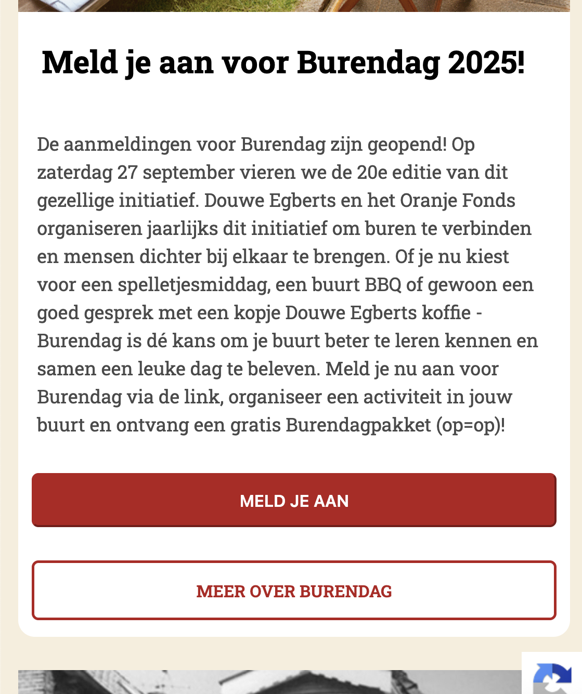
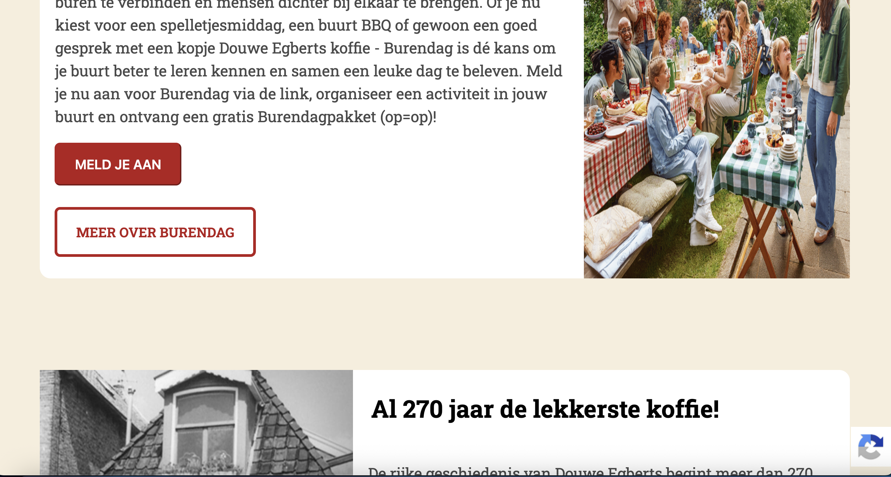

# Procesverslag
Markdown is een simpele manier om HTML te schrijven.  
Markdown cheat cheet: [Hulp bij het schrijven van Markdown](https://github.com/adam-p/markdown-here/wiki/Markdown-Cheatsheet).

Nb. De standaardstructuur en de spartaanse opmaak van de README.md zijn helemaal prima. Het gaat om de inhoud van je procesverslag. Besteedt de tijd voor pracht en praal aan je website.

Nb. Door *open* toe te voegen aan een *details* element kun je deze standaard open zetten. Fijn om dat steeds voor de relevante stuk(ken) te doen.

## Jij

  
uitwerken voor kick-off werkgroep

  ### Auteur:
  Floortje van Hensbergen

  #### Je startniveau:
  rood

  #### Je focus:
  responsive
 

## Je website

  
uitwerken voor kick-off werkgroep

  ### Je opdracht:
  https://www.de.nl 

  #### Screenshot(s) van de eerste pagina (small screen):   
  

  #### Screenshot(s) van de tweede pagina (small screen):
  
 

## Toegankelijkheidstest 1/2 (week 1)

  
uitwerken na test in 2e werkgroep

  ### Bevindingen
  Lijst met je bevindingen die in de test naar voren kwamen:
  
  
  
  
  

  Uit de screenreader test kwamen de volgende bevindingen:
  
  Hierboven zie je dat de screenreader het juiste kopniveau voorleest en de bijbehorende tekst. 
  
  Hierboven zie je dat de screenreader een duidelijk naam voor een afbeelding van een koffiecategorie voorleest.
  
  Hierboven zie je dat de screenreader een productnaam voorleest waarin twee keer dezelfde naam staat.
  
  
  Hierboven zie je eerst dat hij het laatst zichtbare product voorleest van een schuifbalk en vervolgens gaat de screenreader naar een knop die zonder naam of aanduiding wordt benoemd. Zo weet je niet dat je hierop moet drukken om meer producten te zien te krijgen. 

## Breakdownschets (week 1)

  
uitwerken na afloop 3e werkgroep

  ### de hele pagina en dynamisch deel (bijv menu): 
  

  ### wellicht nog een dynamisch deel (bijv filter): 

## Voortgang 1 (week 2)

  
uitwerken voor 1e voortgang

  ### Stand van zaken
  hier dit ging goed & dit was lastig (neem ook screenshots op van delen van je website en code)

Wat goed ging was het maken van mijn breakdownschets, maar ik ben nog niet zeker of deze wel klopt. 
Ik vind het lastig om een start te maken aan mijn code, ondanks dat ik nu een breakdownschets heb, vind ik het moeilijk om hier een HTML en CSS van te schrijven. Ik ben nu vooral ook de meeste tijd aan de lesopdrachten kwijt, ik hoop deze later mee te kunnen nemen in mijn eigen code. 

  ### Agenda voor meeting
  samen met je groepje opstellen

  | student 1      | student 2          | student 3    | student 4        |
  | ---            | ---                | ---          | ---              |
  | dit bespreken  | en dit             | en ik dit    | en dan ik dat    |
  | en dat ook nog | dit als er tijd is | nog een punt | dit wil ik zeker |
  | ...            | ...                | ...          | ...              |

  ### Verslag van meeting
  hier na afloop snel de uitkomsten van de meeting vastleggen

  - Breakdownschets goedgekeurd
  - Rest van de tijd aan mijn HTML schrijven gewerkt

## Voortgang 2 (week 3)

  
uitwerken voor 2e voortgang

  ### Stand van zaken
  hier dit ging goed & dit was lastig (neem ook screenshots op van delen van je website en code)

Wat goed ging was dat ik een grote sprong heb gemaakt met mijn HTML en CSS. 
Ik hoop wat hulp te kunnen krijgen bij wat vragen over mijn hamburgermenu en mijn carousel, deze vind ik namelijk lastig om hetzelfde vorm te geven zoals mijn oorspronkelijke site. 

  ### Agenda voor meeting
  samen met je groepje opstellen

  | student 1      | student 2          | student 3    | student 4        |
  | ---            | ---                | ---          | ---              |
  | dit bespreken  | en dit             | en ik dit    | en dan ik dat    |
  | en dat ook nog | dit als er tijd is | nog een punt | dit wil ik zeker |
  | ...            | ...                | ...          | ...              |

  ### Verslag van meeting
  hier na afloop snel de uitkomsten van de meeting vastleggen

  - Carousel opzet kunnen maken
  - Verdere vragen zijn beantwoord

## Toegankelijkheidstest 2/2 (week 4)

  
uitwerken na test in 9e werkgroep

  ### Bevindingen
  Lijst met je bevindingen die in de test naar voren kwamen (geef ook aan wat er verbeterd is):
  
  
  
  
  

  Wat er uit de screentest kwam:
  
  De screenreader die de aangeeft dat je je in een lijst bevindt.
  
  De screenreader die de juiste afbeeldingstitel voorleest.
  
  De screenreader die je verteld dat je je op een button bevindt.
  
  De screenreader die je je de juiste kopniveau voorleest.

## Voortgang 3 (week 4)

  
uitwerken voor 3e voortgang

  ### Stand van zaken
  hier dit ging goed & dit was lastig (neem ook screenshots op van delen van je website en code)

Wat goed ging was dat ik nu in de laatste week alles een beetje heb kunnen afronden en nu heb ik de tijd om mijn laatste vragen te kunnen stellen. Ook heb ik een checklist gemaakt, zodat ik niks vergeet. 
Wat ik lastig vind is het bedenken op welke manier ik mijn site responsive ga maken, namelijk met grid of flexbox. 

  ### Agenda voor meeting
  samen met je groepje opstellen

  | student 1      | student 2          | student 3    | student 4        |
  | ---            | ---                | ---          | ---              |
  | dit bespreken  | en dit             | en ik dit    | en dan ik dat    |
  | en dat ook nog | dit als er tijd is | nog een punt | dit wil ik zeker |
  | ...            | ...                | ...          | ...              |

  ### Verslag van meeting
  hier na afloop snel de uitkomsten van de meeting vastleggen

  - Veel feedback en vragen kunnen stellen nog
  - Responsive weten te maken van mijn hamburgermenu
  - Te weten gekomen dat voorkeur gaat naar flexbox voor het maken van responsive
  - Voor mijn site ervoor gekozen om zo veel mogelijk flexbox te gebruiken, maar vond één selectie mooier eruit zien aan de hand van grid

## Eindgesprek (week 5)

  
uitwerken voor eindgesprek

  ### Je uitkomst - karakteristiek screenshots:
  

  ### Dit ging goed/Heb ik geleerd: 
  Korte omschrijving met plaatjes

  Wat goed ging:
  - Mijn doel behalen. De site komt goed overeen en ik heb naast het responsive maken ook een aantal dingen kunnen proberen voor de surface laag.
  - Het rosponsive maken van mijn site op een mooie manier aan de hand van flexbox en grid, afgewisseld.
  - Veel nieuwe soorten selectoren geleerd, zo ook veel gebruik gemaakt van :last-of-type etc en geprobeerd pas div te gebruiken als het echt niet anders kon.
  - Ik heb ook mijn site iets toegankelijker kunnen maken door gebruik te maken van betere alt teksten en een semantisch juiste opbouw, waardoor de pagina met een screenreader ook makkelijk gebruikt kan worden. (zie de afbeeldingen bij toegankelijkheidstest 2)
  - Daarnaast ben ik overzichtelijk te werk gegaan en heb ik mijn css ook overzichtelijk gehouden doormiddel van categoriën te maken, zodat ik het zelf sneller terug kon vinden. 
  - Ook ben ik blij dat ik er doormiddel van clamp voor heb kunnen zorgen dat de letters, knoppen en links mee vergroten wanneer je de pagina vergroot.

  
  
  Je ziet dat de tekst en de knoppen worden vergroot wanneer je een groter schermformaat gebruikt.

  ### Dit was lastig/Is niet gelukt:
  Korte omschrijving met plaatjes

  Wat lastig was/niet is gelukt:
  - Wat ik uiteindelijk erg lastig vond was de knoppen en de procesbalk onder mijn carousel weer te geven, dit is mij dan ook niet gelukt. Ik dacht eerst hiermee in javascript aan de slag te kunnen, alleen bleek dit beter te gaan via de codepen voorbeeld met css. Hiervoor moest ik chrome gebruiken om daar de buttons te kunnen zien, alleen werkt dit niet goed op mijn laptop en lukte dit dus ook niet meer om dit goed voor de deadline te laten werken.  
  - Ook heb ik voor mijn kleinere schermformaat veel gebruik kunnen maken van grid. Toen ik dit later responsive ging maken kwam ik er ook achter dat je dit met flexbox mooi kon weergeven. Achteraf gezien had ik dit dus ook voor het kleine formaat kunnen doen. Aan de andere kant heb ik nu wel goed met beide leren werken en zou ik het ook kunnen aanpassen.
  - Wat ik nog meer lastig vond was het juist meeschalen van de afbeeldingen bij sommige sections. Al zie je dit maar bij 1 afbeelding echt terug, bij de rest ziet het er prima uit. 

  
  Je ziet alleen dat het er bij de bovenste afbeelding een beetje raar uitziet, de rest schaalt best goed mee.

## Bronnenlijst

  
continu bijhouden terwijl je werkt

  Nb. Wees specifiek ('css-tricks' als bron is bijv. niet specifiek genoeg). 
  Nb. ChatGpT en andere AI horen er ook bij.
  Nb. Vermeld de bronnen ook in je code.

  Google AI:

  1. hoe afbeelding naast column evengroot uitlijnen css, 
  https://www.google.com/search?client=safari&rls=en&q=hoe+afbeelding+naast+column+evengroot+uitlijnen+css&ie=UTF-8&oe=UTF-8 

  2. hoe maak je een website responsive in html,
  https://www.google.com/search?client=safari&rls=en&q=hoe+maak+je+een+website+responsive+in+html&ie=UTF-8&oe=UTF-8 

  3. hoe kan je tekst precies in het midden uitlijnen in flex boxes css,
  https://www.google.com/search?client=safari&rls=en&q=hoe+kan+je+tekst+precies+in+het+midden+uitlijnen+in+flex+boxes+css&ie=UTF-8&oe=UTF-8

  4. aanvinkhokje html opmaak css,
  https://www.google.com/search?q=aanvinkhokje+html+opmaak+css&client=safari&sca_esv=318dfbf2fb24382c&rls=en&biw=760&bih=726&ei=08vOaNCsDIrt7_UPhMfssA8&ved=0ahUKEwiQ4v2s1-ePAxWK9rsIHYQjG_YQ4dUDCBA&uact=5&oq=aanvinkhokje+html+opmaak+css&gs_lp=Egxnd3Mtd2l6LXNlcnAiHGFhbnZpbmtob2tqZSBodG1sIG9wbWFhayBjc3MyChAhGKABGMMEGAoyChAhGKABGMMEGApIsiFQiARYiBtwAXgBkAEAmAFqoAHlBaoBAzkuMbgBA8gBAPgBAZgCC6ACsQbCAgoQABiwAxjWBBhHwgIFEAAY7wXCAggQABiABBiiBJgDAIgGAZAGCJIHBDEwLjGgB70msgcDOS4xuAekBsIHBDItMTHIBzY&sclient=gws-wiz-serp

  5. css html invullijst met ster,
  https://www.google.com/search?q=css+html+invullijst+met+ster&client=safari&sca_esv=318dfbf2fb24382c&rls=en&biw=760&bih=726&ei=aMXOaNr3GpiD9u8PlPTkoAc&ved=0ahUKEwjay9Od0eePAxWYgf0HHRQ6GXQQ4dUDCBA&uact=5&oq=css+html+invullijst+met+ster&gs_lp=Egxnd3Mtd2l6LXNlcnAiHGNzcyBodG1sIGludnVsbGlqc3QgbWV0IHN0ZXIyBRAhGKABMgUQIRigATIFECEYoAFI3Y4BUMEQWNGAAXABeAGQAQCYAWqgAaUSqgEEMjYuMrgBA8gBAPgBAZgCHaACnRSoAgrCAhAQLhgDGLQCGOoCGI8B2AEBwgIQEAAYAxi0AhjqAhiPAdgBAcICCBAAGIAEGLEDwgIOEC4YgAQYsQMY0QMYxwHCAg4QABiABBixAxiDARiKBcICDhAuGIAEGLEDGIMBGIoFwgILEC4YgAQYsQMYgwHCAgUQLhiABMICCxAuGIAEGMcBGK8BwgIFEAAYgATCAggQLhiABBixA8ICCxAAGIAEGLEDGIMBwgINEAAYgAQYsQMYQxiKBcICBhAAGBYYHsICBxAAGIAEGBPCAggQABgTGBYYHsICBRAhGJ8FwgIEECEYFcICBxAhGKABGArCAggQABgIGA0YHsICChAAGAgYChgNGB7CAggQABiiBBiJBcICBRAAGO8FwgIIEAAYgAQYogSYAxTxBcTd9GALDC7VugYECAEYCpIHBDIyLjegB9eWAbIHBDIxLje4B4kUwgcIMC4xLjIwLjjIB7IB&sclient=gws-wiz-serp

  6. hoe een nog niet ingevuld ster in html toevoegen,
  https://www.google.com/search?q=hoe+een+nog+niet+ingevuld+ster+in+html+toevoegen&client=safari&sca_esv=318dfbf2fb24382c&rls=en&biw=760&bih=726&ei=RcPOaIONLcmli-gP24bgmAg&ved=0ahUKEwjDw_uYz-ePAxXJ0gIHHVsDGIMQ4dUDCBA&uact=5&oq=hoe+een+nog+niet+ingevuld+ster+in+html+toevoegen&gs_lp=Egxnd3Mtd2l6LXNlcnAiMGhvZSBlZW4gbm9nIG5pZXQgaW5nZXZ1bGQgc3RlciBpbiBodG1sIHRvZXZvZWdlbjIFECEYoAEyBRAhGKABMgUQIRigATIFECEYoAFInkhQAFi2RXAAeACQAQCYAXugAawfqgEENDQuNLgBA8gBAPgBAZgCMKAC_CHCAgsQABiABBixAxiDAcICCBAAGIAEGLEDwgIOEAAYgAQYsQMYgwEYigXCAgUQABiABMICDhAuGIAEGLEDGNEDGMcBwgIKEAAYgAQYQxiKBcICCxAuGIAEGLEDGIMBwgILEC4YgAQYxwEYrwHCAg4QLhiABBixAxjHARivAcICBBAAGAPCAgsQLhiABBixAxjUAsICBRAuGIAEwgIHEAAYgAQYCsICBhAAGBYYHsICCBAAGIAEGKIEwgIFEAAY7wXCAgUQIRifBcICBBAhGBXCAgcQIRigARgKmAMAkgcFMzguMTCgB8OZArIHBTM4LjEwuAf8IcIHCDAuNC40MC40yAfmAQ&sclient=gws-wiz-serp

  7. tekstveld formulier css outline style schaduw alleen als erop,
  https://www.google.com/search?q=tekstveld+formulier+css+outline+style+schaduw+alleen+als+erop&client=safari&sca_esv=318dfbf2fb24382c&rls=en&ei=W8HOaKjME8Lui-gPi46WsA4&ved=0ahUKEwjo5Y6vzeePAxVC9wIHHQuHBeYQ4dUDCBA&uact=5&oq=tekstveld+formulier+css+outline+style+schaduw+alleen+als+erop&gs_lp=Egxnd3Mtd2l6LXNlcnAiPXRla3N0dmVsZCBmb3JtdWxpZXIgY3NzIG91dGxpbmUgc3R5bGUgc2NoYWR1dyBhbGxlZW4gYWxzIGVyb3BIszVQhQJYmTJwAXgAkAEAmAGSAaAB5QqqAQQxNC4yuAEDyAEA-AEBmAIQoAKVC8ICCxAAGIAEGLADGKIEwgIIEAAYsAMY7wXCAgUQIRigAcICBRAhGJ8FwgIIEAAYgAQYogTCAgUQABjvBZgDAIgGAZAGA5IHBDE0LjKgB4ZMsgcEMTMuMrgHkQvCBwQyLTE2yAdD&sclient=gws-wiz-serp

  8. tekstveld formulier css,
  https://www.google.com/search?client=safari&rls=en&q=tekstveld+formulier+css&ie=UTF-8&oe=UTF-8

  9. horizontale lijn invoegen css,
  https://www.google.com/search?client=safari&rls=en&q=horizontale+lijn+invoegen+css&ie=UTF-8&oe=UTF-8

  10. hoe hamburger menu van links laten verschijnen css,
  https://www.google.com/search?client=safari&sca_esv=318dfbf2fb24382c&rls=en&q=hoe+hamburger+menu+van+links+laten+verschijnen+css&spell=1&sa=X&ved=2ahUKEwiPkoTJ2vuPAxVm3AIHHVJkLhkQBSgAegQIDRAB&biw=1440&bih=726&dpr=2 

  11. hoe krijg je afbeeldingen precies onder in css,
  https://www.google.com/search?q=hoe+krijg+je+afbeeldingen+precies+onder+in+css&client=safari&sca_esv=318dfbf2fb24382c&rls=en&ei=VLHOaPC8OZqK9u8P5NTE8Ao&oq=hoe+krijg+je+afbeeldingen+precies+onder&gs_lp=Egxnd3Mtd2l6LXNlcnAiJ2hvZSBrcmlqZyBqZSBhZmJlZWxkaW5nZW4gcHJlY2llcyBvbmRlcioCCAEyBRAhGKABMgUQIRigAUjsfVAAWL5lcAB4AJABAJgBsgGgAYsZqgEEMzMuNrgBAcgBAPgBAZgCJ6ACzRvCAgoQABiABBhDGIoFwgILEAAYgAQYsQMYgwHCAggQABiABBixA8ICDhAuGIAEGLEDGMcBGK8BwgIEEAAYA8ICBRAAGIAEwgILEC4YgAQYsQMY1ALCAgUQLhiABMICBhAAGBYYHsICBhAAGA0YHsICCBAAGAgYDRgewgIFECEYnwXCAgcQIRigARgKmAMAkgcFMjcuMTKgB7rvAbIHBTI3LjEyuAfNG8IHCjAuNS4yNy42LjHIB-sB&sclient=gws-wiz-serp 

  12. hoe kan je een image een gehele box laten vullen css,
  https://www.google.com/search?client=safari&rls=en&q=hoe+kan+je+een+image+een+gehele+box+laten+vullen+css&ie=UTF-8&oe=UTF-8

  13. hoe krijg je met grid een img op de achtergrond met start en end,
  https://www.google.com/search?q=hoe+krijg+je+met+grid+een+img+op+de+achtergrond+met+start+en+end&client=safari&sca_esv=81be61c3dad309e5&rls=en&ei=b-3LaJL4JqG8i-gPm9eqsAk&ved=0ahUKEwjS6_L9muKPAxUh3gIHHZurCpYQ4dUDCBA&uact=5&oq=hoe+krijg+je+met+grid+een+img+op+de+achtergrond+met+start+en+end&gs_lp=Egxnd3Mtd2l6LXNlcnAiQGhvZSBrcmlqZyBqZSBtZXQgZ3JpZCBlZW4gaW1nIG9wIGRlIGFjaHRlcmdyb25kIG1ldCBzdGFydCBlbiBlbmRIAFAAWABwAHgAkAEAmAEAoAEAqgEAuAEDyAEA-AEBmAIAoAIAmAMAkgcAoAcAsgcAuAcAwgcAyAcA&sclient=gws-wiz-serp

  14. hoe kan het dat er bij positionfixed een item verdwijnt tijden richting scrollen,
  https://www.google.com/search?client=safari&rls=en&q=hoe+kan+het+dat+er+bij+positionfixed+een+item+verdwijnt+tijden+richting+scrollen&ie=UTF-8&oe=UTF-8

  15. twee elementen naast elkaar css,
  https://www.google.com/search?q=twee+elementen+naast+elkaar+css&client=safari&sca_esv=73afc9bb409a06fd&rls=en&ei=7W3JaPXCL8PQi-gPr4-J-A4&ved=0ahUKEwi17YWNud2PAxVD6AIHHa9HAu8Q4dUDCBA&uact=5&oq=twee+elementen+naast+elkaar+css&gs_lp=Egxnd3Mtd2l6LXNlcnAiH3R3ZWUgZWxlbWVudGVuIG5hYXN0IGVsa2FhciBjc3MyCBAAGLADGO8FMggQABiwAxjvBTILEAAYgAQYsAMYogQyCxAAGLADGKIEGIkFMgsQABiABBiwAxiiBEi2D1AAWABwAXgAkAEAmAEAoAEAqgEAuAEDyAEAmAIBoAIHmAMAiAYBkAYFkgcBMaAHALIHALgHAMIHAzItMcgHBA&sclient=gws-wiz-serp

  16. hoe kan je meerdere :root var in css,
  https://www.google.com/search?q=hoe+kan+je+meerdere+%3Aroot+var+in+css&client=safari&sca_esv=8fb985a9e177f272&rls=en&ei=91fJaOziFZXfi-gPodCqgAs&ved=0ahUKEwisuoiUpN2PAxWV7wIHHSGoCrAQ4dUDCBA&uact=5&oq=hoe+kan+je+meerdere+%3Aroot+var+in+css&gs_lp=Egxnd3Mtd2l6LXNlcnAiJGhvZSBrYW4gamUgbWVlcmRlcmUgOnJvb3QgdmFyIGluIGNzczIHECEYoAEYCjIHECEYoAEYCjIHECEYoAEYCkjBnAFQAFicmwFwAXgAkAEAmAGCAaABrBOqAQQyMS45uAEDyAEA-AEBmAIfoAKwFagCCsICEBAuGAMYtAIY6gIYjwHYAQHCAhAQABgDGLQCGOoCGI8B2AEBwgILEAAYgAQYsQMYgwHCAggQABiABBixA8ICDhAAGIAEGLEDGIMBGIoFwgIFEAAYgATCAhEQLhiABBixAxjRAxiDARjHAcICChAAGIAEGEMYigXCAgsQLhiABBjHARivAcICCxAuGIAEGLEDGIMBwgIFEC4YgATCAgQQABgDwgILEC4YgAQYsQMY1ALCAgYQABgWGB7CAgUQABjvBcICCBAAGIAEGKIEwgIFECEYnwXCAggQABiiBBiJBcICBBAhGBWYAxjxBbQbkDxeKkkFugYECAEYCpIHBDIyLjmgB9_GAbIHBDIxLjm4B5gVwgcIMC4zLjIxLjfIB7wB&sclient=gws-wiz-serp

  17. hoe krijg je onderdelen in een li item onder elkaar css,
  https://www.google.com/search?q=hoe+krijg+je+onderdelen+in+een+li+item+onder+elkaar+css&client=safari&sca_esv=8fb985a9e177f272&rls=en&ei=VFLJaIT-KLS3i-gPxqLokQo&ved=0ahUKEwiE-JHknt2PAxW02wIHHUYROqIQ4dUDCBA&uact=5&oq=hoe+krijg+je+onderdelen+in+een+li+item+onder+elkaar+css&gs_lp=Egxnd3Mtd2l6LXNlcnAiN2hvZSBrcmlqZyBqZSBvbmRlcmRlbGVuIGluIGVlbiBsaSBpdGVtIG9uZGVyIGVsa2FhciBjc3MyBRAAGO8FMgUQABjvBTIIEAAYogQYiQVIq70BUK4MWMy7AXACeAGQAQCYAdoCoAHHKKoBCDY2LjQuMC4xuAEDyAEA-AEBmAJGoAL4KagCCsICChAAGLADGNYEGEfCAgYQABgWGB7CAggQABgIGA0YHsICBxAhGKABGArCAgUQIRigAcICBRAAGIAEwgIFEC4YgATCAgsQLhiABBjHARivAcICCBAAGIAEGLEDwgIEEAAYA8ICCxAAGIAEGLEDGIMBwgIKEAAYgAQYQxiKBcICDhAuGIAEGLEDGNEDGMcBwgIQEC4YAxi0AhjqAhiPAdgBAcICEBAAGAMYtAIY6gIYjwHYAQHCAg4QABiABBixAxiDARiKBcICERAuGIAEGLEDGNEDGIMBGMcBwgILEC4YgAQYsQMYgwHCAgsQLhiABBixAxjUAsICFBAuGIAEGJcFGNwEGN4EGOAE2AECwgIFECEYnwXCAgQQIRgVwgIIEAAYgAQYogSYAwXxBcDfJnnDIfXoiAYBkAYFugYECAEYCroGBggCEAEYFJIHCDY2LjMuMC4xoAfgiwOyBwg2NC4zLjAuMbgH5CnCBwgwLjkuNTcuNMgHywI&sclient=gws-wiz-serp

  18. onderstrepen html,
  https://www.google.com/search?q=onderstrepen+html&client=safari&sca_esv=8fb985a9e177f272&rls=en&ei=i1HJaNnCDJ-ii-gPjKGjqA8&ved=0ahUKEwiZtImEnt2PAxUf0QIHHYzQCPUQ4dUDCBA&uact=5&oq=onderstrepen+html&gs_lp=Egxnd3Mtd2l6LXNlcnAiEW9uZGVyc3RyZXBlbiBodG1sMgYQABgWGB4yBhAAGBYYHjIFECEYoAEyBRAhGJ8FSKk3UABYuzRwAHgAkAEAmAFVoAHdCqoBAjIwuAEDyAEA-AEBmAIUoALkC8ICCBAAGBMYBxgewgIGEAAYBxgewgIJEAAYgAQYChgNwgIIEAAYBxgKGB7CAggQABgFGAoYHsICCBAAGAUYBxgewgIIECEYoAEYwwTCAgoQIRigARjDBBgKwgIHECEYoAEYCsICBRAAGIAEwgIIEAAYCBgNGB6YAwDiAwUSATEgQJIHAjIwoAe9TrIHAjIwuAfkC8IHCDAuMy4xMy40yAdq&sclient=gws-wiz-serp 
 

  MDN:

  1. https://developer.mozilla.org/en-US/docs/Web/CSS/CSS_flexible_box_layout/Basic_concepts_of_flexbox 

  2. https://developer.mozilla.org/en-US/docs/Web/CSS/::scroll-button

  3. https://developer.mozilla.org/en-US/docs/Web/CSS/overflow-block

  4. https://developer.mozilla.org/en-US/docs/Web/CSS/CSS_scrollbars_styling 

  5. https://developer.mozilla.org/en-US/docs/Web/CSS/scrollbar-gutter 

  6. https://developer.mozilla.org/en-US/docs/Web/CSS/::checkmark 

  7. https://developer.mozilla.org/en-US/docs/Web/CSS/background-position 

  8. https://developer.mozilla.org/en-US/docs/Web/CSS/CSS_backgrounds_and_borders/Resizing_background_images

  9. https://developer.mozilla.org/en-US/docs/Web/CSS/background-image

  10. https://developer.mozilla.org/en-US/docs/Web/CSS/display

  11. https://developer-mozilla-org.translate.goog/en-US/docs/Web/CSS/CSS_selectors/Selectors_and_combinators?_x_tr_sl=en&_x_tr_tl=nl&_x_tr_hl=nl&_x_tr_pto=sge

  12. https://developer.mozilla.org/en-US/docs/Web/HTML/Reference/Elements

  13. https://developer-mozilla-org.translate.goog/en-US/docs/Web/CSS/CSS_nesting/Using_CSS_nesting?_x_tr_sl=en&_x_tr_tl=nl&_x_tr_hl=nl&_x_tr_pto=rq

  14. https://developer-mozilla-org.translate.goog/en-US/docs/Web/CSS/Nesting_selector?_x_tr_sl=en&_x_tr_tl=nl&_x_tr_hl=nl&_x_tr_pto=rq

  15. https://developer-mozilla-org.translate.goog/en-US/docs/Web/CSS/Type_selectors?_x_tr_sl=en&_x_tr_tl=nl&_x_tr_hl=nl&_x_tr_pto=rq

  16. https://developer-mozilla-org.translate.goog/en-US/docs/Web/CSS/Pseudo-classes?_x_tr_sl=en&_x_tr_tl=nl&_x_tr_hl=nl&_x_tr_pto=rq

  17. https://developer-mozilla-org.translate.goog/en-US/docs/Web/CSS/Attribute_selectors?_x_tr_sl=en&_x_tr_tl=nl&_x_tr_hl=nl&_x_tr_pto=rq

  18. https://developer.mozilla.org/en-US/docs/Web/CSS/CSS_grid_layout/Basic_concepts_of_grid_layout

  19. https://developer.mozilla.org/en-US/docs/Web/CSS/CSS_grid_layout/Box_alignment_in_grid_layout

  20. https://developer.mozilla.org/en-US/docs/Web/CSS/CSS_grid_layout/Grid_template_areas

  21. https://developer.mozilla.org/en-US/docs/Web/CSS/CSS_grid_layout/Relationship_of_grid_layout_with_other_layout_methods

  22. https://developer.mozilla.org/en-US/docs/Web/CSS/Properties 

  css-tricks:

  1. https://css-tricks.com/snippets/css/a-guide-to-flexbox/

  Stackoverflow:

  1. https://stackoverflow.com/questions/14732448/how-do-i-make-the-scrollbar-on-a-div-only-visible-when-necessary 

  Codepen:

  - Hier heb ik mijn overige info vandaag gehaald, en dan vooral voor de hamburgermenu en mijn carousel.

